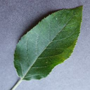

# Leaf Classification

Link to [Codalab competition](https://codalab.lisn.upsaclay.fr/competitions/226#learn_the_details-overview).

## Authors

- *[Aleksandra Krajnović](https://github.com/akrajnovic)*
- *Iva Milojkovic*
- *[Mariusz Wiśniewski](https://github.com/Nexer8)*

## Problem Description

This repository contains various approaches to classify images of leaves (like the ones in the example image below), which are divided into categories according to the species of the plant to which they belong. Being a classification problem, given an image, the goal is to predict the correct class label.

 

## Data

Zipped dataset is available under the following [link](https://drive.google.com/file/d/11iZ3AZ1OrUU4TimBlFVneV0e7-_HrWgu/view?usp=sharing).

### Dataset Details

- Image size: 256x256
- Color space: *RGB* (read as *'rgb'* in `ImageDataGenerator.flow_from_directory ('color_mode' attribute)` or use `PIL.Image.open('imgname.jpg').convert('RGB')`)
- File Format: *JPG*
- Number of classes: 14
- Classes:
  - 0: "Apple"
  - 1: "Blueberry"
  - 2: "Cherry"
  - 3: "Corn"
  - 4: "Grape"
  - 5: "Orange"
  - 6: "Peach"
  - 7: "Pepper"
  - 8: "Potato"
  - 9: "Raspberry"
  - 10: "Soybean"
  - 11: "Squash"
  - 12: "Strawberry"
  - 13: "Tomato"

### Dataset Structure

- Single folder:
  - training: containing 17728 images already divided in sub-folders, based on their class.
- Training images per class:
  - Apple: 988
  - Blueberry: 467
  - Cherry: 583
  - Corn: 1206
  - Grape: 1458
  - Orange: 1748
  - Peach: 977
  - Pepper: 765
  - Potato: 716
  - Raspberry: 264
  - Soybean: 1616
  - Squash: 574
  - Strawberry: 673
  - Tomato: 5693

## Approaches

- *ResNet50 V2* with transfer learning, adjusted weights, *PReLu* activation layer, and categorical cross-entropy loss.
- Fine-tuned *ResNet50 V2* with adjusted weights and a *PReLu* activation layer, and categorical cross-entropy loss.
- *ResNet50 V2* with transfer learning and *focal loss*.
- *ResNet101 V2* with adjusted weights, categorical cross-entropy loss, and incomplete training.
- *ResNet50 V2* with transfer learning, categorical cross-entropy loss, and adjusted weights.
- Fine-tuned *ResNet50 V2* with transfer learning, categorical cross-entropy loss, and adjusted weights.
- Fine-tuned *Xception* model with adjusted weights and categorical cross-entropy loss.
- An *ensemble* model with adjusted weights.
- And *ResNet50 V2* with transfer learning, focal loss, and adjusted weights.
